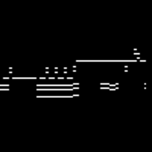

<!-- PROJECT SHIELDS -->
<!--
*** I'm using markdown "reference style" links for readability.
*** Reference links are enclosed in brackets [ ] instead of parentheses ( ).
*** See the bottom of this document for the declaration of the reference variables
*** for contributors-url, forks-url, etc. This is an optional, concise syntax you may use.
*** https://www.markdownguide.org/basic-syntax/#reference-style-links
-->
<!-- PROJECT LOGO -->
<br />
<p align="center">
  <a href="https://github.com/othneildrew/Best-README-Template">
    
  </a>

  <h3 align="center">Project_Edward</h3>

  <p align="center">
    Ett program som genererar music!


<!-- TABLE OF CONTENTS -->
## Innehållsförteckning

* [Om Projektet](#om-projektet)
  * [Byggd Med](#byggd-med)
* [Börja](#börja)
  * [Förarbete](#förarbete)
  * [Drive](#drive)
  * [Träning](#träning)
* [Usage](#usage)


<!-- ABOUT THE PROJECT -->
## Om Projektet

Projektet handlar om att skapa music utav ett dataset i form av midi. Filen ska helst vara ett instrument. Jag har gått igenom andra metoder som Lstm för att generera musik. Jag blev missnöjd med resultaten och bestämde att arbeta vidare. Lstm tog in massor med data och kan bestämma vilka noter som ska spelas efter på varandra. Konsekvensen blev att det inte gick att implemeterar durationer och pauser. 

För projektet har jag tänkt använda stylegan för att göra musik. Stylegan är teknisk sätt för bilder. Vilket vi kan använda. Därför använder vi midifiler. Man kan konvertera midifiler till ett kordinat system. X-axeln blir tid och Y axen blir noten. Vi kan spara koriatsystement som en png bild. Varje låt blir ungefär 5-50 bilder långa. Förhoppnings vis får vi ett bra resultat. En risk är att stylegan tar bilder oavsett vart i sången den är. Det vill säga att stylegan kommer inte uppfatta om en början och slut, allt är detsamma. 

<p align="center">
  <a href="https://github.com/othneildrew/Best-README-Template">
    
</a>

Överblick av projektet:
* Samla in midi filer i formen (.mid) 
* Konverterar mid filerna till .png
* Gör om bilderna till ett data set (tfrecord) 
* Använd datasetet och börja träna
* Använd bilderna och minimera den till 100*106 res för att senare konvertera den till mid fil igen
Spela midifilerna

### Byggd Med
Här hittar du orginal koder som hjälpte med projektet.
* [Stylegan](https://github.com/t04glovern/stylegan-pokemon)
* [Midi2img and Img2midi](https://github.com/mathigatti/midi2img)
* [Resizing images](https://auth0.com/blog/image-processing-in-python-with-pillow/)


<!-- GETTING STARTED -->
## Börja

Det här projektet använder [datasetet](https://www.kaggle.com/soumikrakshit/classical-music-midi). Det här datasetet är klassisk musik som bara spelas av ett instrument. 
Här är även min [google-colab](https://colab.research.google.com/drive/1HbpWlQ8gaTG6c4ps7POXD-sSs-6mbWLg#scrollTo=JF1mwki7pjZc) fil som du kan följa.

### Förarbete

Vi börjar med att clona det vi behöver för det här projektet. Vi gör även mappar för vart bilderna kommer hamna. 
Sist använder vi tensorflow 1.
```sh
%cd /content/
!git clone https://github.com/abbbringu/Project_Edward
!mkdir Music
!mkdir Raw
!mkdir Images
%tensorflow_version 1.x
```

### Drive

För att koppla colab med drive använder vi:
```sh
from google.colab import drive
drive.mount('/content/drive')
# drive.mount("/content/drive", force_remount=True)
%cd /content/drive/My Drive/
!mkdir STYLE-GAN
%ls
%cd /content

!ln -s "/content/drive/My Drive/STYLE-GAN" /STYLE-GAN
%cd /STYLE-GAN
%ls
```
Samtidigt skapar vi en mapp "STYLE-GAN" och gör en förkorning från /content/drive/My Drive/STYLE-GAN till /STYLE-GAN

### Eget Dataset

För att göra vårt eget dataset måste vi först ha bilder. Gör en mapp i STYLE-GAN som heter "Music" i google drive. Ta bort filer som slutar på ".MID" eller (".MIDI"). Koden kan endast ta in ".mid" filer. Sedan kör vi koden midi2img-py. Alla bilder borde ligga i /content/Raw. Bilderna i /Raw kommer ut i storlek 100*106 och därför behöver vi resize_img.py vilket gör om de till 256*256. Bilderna hamnar då i Images. 

När vi har bilderna använder vi:
```sh
%cd /content/stylegan-pokemon/stylegan
!python dataset_tool.py create_from_images (Path till vart datan ska sparas) (/content/Images/)
```
Eftersom stylegan använder sig utav tfrecord måste vi konvertera bilderna. (Startkt rekomenerat att bilderna sparas i driven)

### Träning


<!-- USAGE EXAMPLES -->
## Usage

Use this space to show useful examples of how a project can be used. Additional screenshots, code examples and demos work well in this space. You may also link to more resources.

_For more examples, please refer to the [Documentation](https://example.com)_
